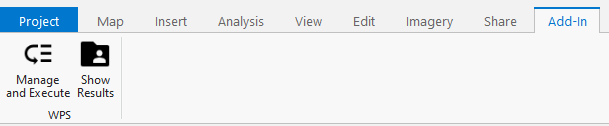
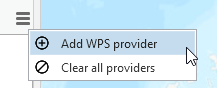
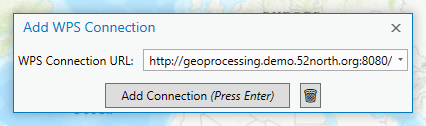
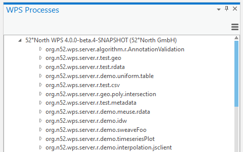
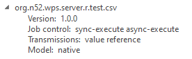
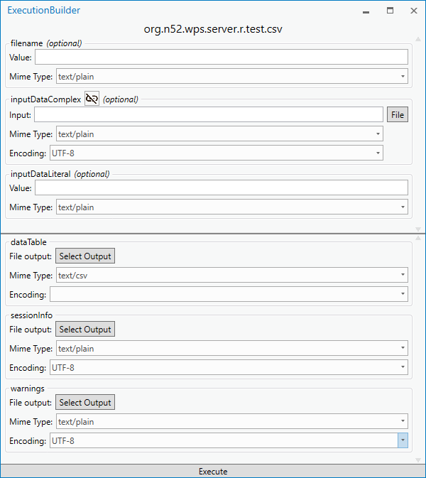
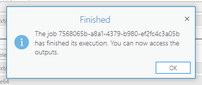
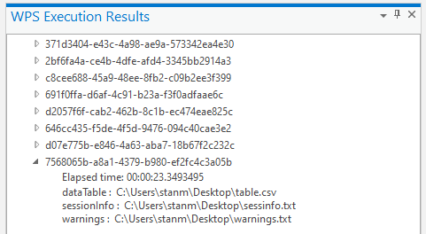
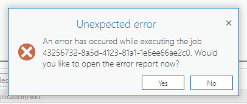

<h3 align="center">
    
    
<b>WPS client for ArcGIS Pro</b>

</h3>

    <a href="#description">Description</a> •
    <a href="#usage">Usage</a> •
    <a href="#license">License</a>

# WPS client for ArcGIS Pro

## Description

This project was created initially during [Google Summer of Code 2019](https://summerofcode.withgoogle.com/projects/#6595064984240128).

This Add-In was created for ArcGIS Pro. It allows the users of the software to manage WPS providers within the software and offers a smooth integration. You can add multiple servers, preview the capabilities and execute your own processes. A history of your executed processes will be displayed in a results panel, where you can see the returned values or the path to the respective files.

## Installation

Download the `.esriAddinX` file from the releases then double click on it. You must then click on the `Install` button, which will do the rest of the work for you. Once the installation is complete the Add-In will be available in ArcGIS Pro.

## Usage

After installing the plugin you must go to the Add-In tab in the menu bar and click `Manage and Execute`. This will open the WPS processes panel which will contain all the capabilities offered by a WPS provider.

Click on the small icon at the top right of the WPS processes panel to open the secondary menu, then click on `Add WPS provider`.

You will then have to input your WPS server URL in to the popup that just appeared. Keep in mind that once you put a server there, it will be saved in your preferences and will be there the next time you want to add it back after restarting ArcGIS Pro. To clear your history of servers click on the small bin icon.

Once the connection has been established with the server, it will appear in the WPS processes panel. Double clicking it will expand the server capabilities.

Clicking on a process will expand it further and show you the relevant information to that process.

Once you have spotted the process that interests you, in order to execute it you must double click on its name. A window that will guide you to create the execution request will appear. Just like so.

Once you have filled the adequate inputs, either with a raw value or file, you must then select your outputs. Keep in mind that the outputs shown aren't the ones that you will necessarily receive. In order to receive a specific output, you must check `Include` if it's a simple literal value, or select an output file if it's something more complex.

You can now click `Execute` and wait for the process to finish. A completion popup with the job id will appear once the process is done executing.

The job id is shown you for identification purposes, because you'll have to look it up in the results panel. The newest result is the latest one on the list.

Once you double click the result id, it will show all the received outputs and the elapsed time for the execution. You can quick open the location of an output by double clicking the file path.

### In case of an error

Things might go wrong during the execution and you might not be able to know excatly what happened. Therefore an error popup will appear and a debugging log will be saved to your local machine *(here: `%appdata%\ArcGisProWpsAddIn\ErrorReports`)*. These logs aren't sent to anyone automatically and it is up to you to share this with the developers of the add-in or the WPS providers.

## License

[Apache v2.0](https://www.apache.org/licenses/LICENSE-2.0)
